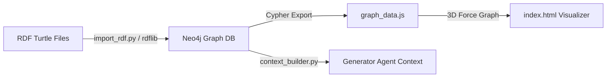
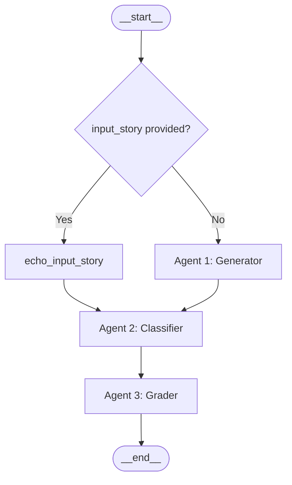
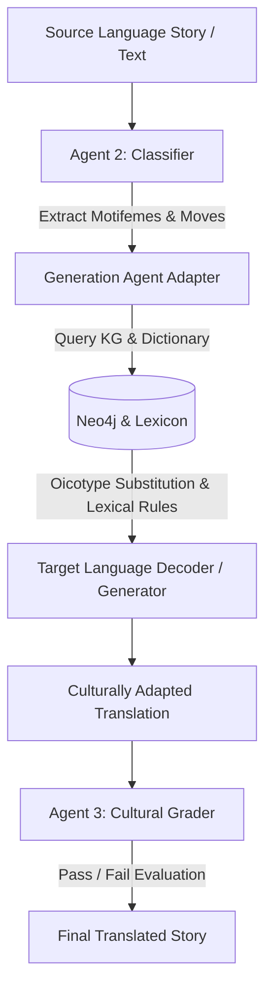

# Research Overview & Technical Documentation: Ju|'hoansi Narrative Agentic Generator (`jnang`)

## Executive Summary & Research Purpose

Computational folkloristics and automated narrative generation systems have historically relied on Indo-European formalist paradigms. Systems building on Vladimir Propp's *Morphology of the Folktale* (1928) often implicitly encode Western narrative assumptions: long 31-function linear quest structures, static character archetypes (Hero, Princess, Villain), individualistic ascension to wealth/monarchy, and punitive execution of antagonists.

When applied to indigenous African oral traditions—specifically the **Ju|'hoansi** San people of the Kalahari—these European formalisms fail. Ju|'hoansi oral narratives are structurally compact, episodic, symmetrical, and deeply tied to ecological survival, radical egalitarianism, communal resource sharing, complex kinship networks, and spatial binary oppositions between the human Camp and the supernatural Bush.

The **Ju|'hoansi Narrative Agentic Generator (`jnang`)** research project bridges formalist narrative modeling (Alan Dundes' motifemes, Vladimir Propp's narrative functions, Claude Lévi-Strauss' paradigmatic binary oppositions) with indigenous Ju|'hoansi oral epistemologies. The system implements a 3-agent pipeline orchestrated by LangGraph, backed by an RDF Turtle narrative ontology and Neo4j Knowledge Graph, to generate, classify, evaluate, and structurally adapt culturally authentic folktales.

---

## 1. How and Why We Created the Ontology

### 1.1 Why We Created the Ontology

Standard narrative ontologies cannot represent Ju|'hoansi oral tradition due to four structural misalignments:

1. **Role Fluidity**: Indo-European formalisms assign static character roles (e.g. Hero, Donor, Helper). In Ju|'hoansi narratives, character roles are porous and dynamic—for example, the Trickster character is simultaneously a troublemaker (Villain/False Hero) and a culture-bringer or helper.
2. **Spatial Binary Oppositions**: Action rules depend on spatial location. As conceptualized by Claude Lévi-Strauss, the **Camp** represents human social order, safety, and egalitarian sharing, while the **Bush** represents wild nature, danger, spirit encounters ($g//awasi$), and physical metamorphosis. Narrative functions cannot be evaluated without spatial tracking.
3. **Egalitarian & Resource-Centric Resolutions**: Resolutions in European tales reward individual heroism with weddings, money, or royal titles ($W^*$). Ju|'hoansi narratives resolve through communal restoration—sharing food ($zo$ honey, meat, gathered roots), water access, and social harmony.
4. **Indigenous Motif Taxonomy**: Universal motifs map onto local ecological and spiritual objects (gemsbok horns, digging sticks, rain-animals, $n|um$ healing energy) rather than magical swords or rings.

To formalize these constraints into machine-readable logic, we created a specialized narrative ontology.

### 1.2 How We Created the Ontology

The ontology was constructed using standard Resource Description Framework (RDF) and Web Ontology Language (OWL) in Turtle syntax ([`folktales_ontology.ttl`](file:///c:/Users/lmy/source/repos/jnang/context/data/folktales_ontology.ttl) and [`gemini-code-rdf.txt`](file:///c:/Users/lmy/source/repos/jnang/context/data/gemini-code-rdf.txt)).

#### Namespaces Defined:
```turtle
@prefix rdf:   <http://www.w3.org/1999/02/22-rdf-syntax-ns#> .
@prefix rdfs:  <http://www.w3.org/2000/01/rdf-schema#> .
@prefix owl:   <http://www.w3.org/2002/07/owl#> .
@prefix propp: <http://ontology.narrative.org/propp#> .
@prefix story: <http://ontology.narrative.org/honey-flies#> .
```

#### Core Schema Classes:
* `propp:Character` (`owl:Class`): Narrative participants (human, animal, or spirit).
* `propp:Object` (`owl:Class`): Items present in the ecosystem.
* `propp:MagicalAgent` (`rdfs:subClassOf propp:Object`): Specialized items or supernatural entities carrying transformational power.
* `propp:NarrativeFunction` (`owl:Class`): Structural plot actions/moves.
* `propp:ProppianRole` (`owl:Class`): Functional personas (`FalseHero`, `SuccessfulModel`, `Helper`).

#### Object Properties & Predicates:
* `propp:hasRole` (`domain: Character`, `range: ProppianRole`): Binds a character to a functional role.
* `propp:performsFunction` (`domain: Character`, `range: NarrativeFunction`): Associates a character with a plot action.
* `propp:lacks` (`domain: Character`, `range: MagicalAgent`): Expresses initial deficiency or need.
* `propp:follows` (`domain: NarrativeFunction`, `range: NarrativeFunction`): Establishes sequential dependency between moves.

#### Canonical Instance Modeling ("The Honey and the Flies"):
The ontology models reference folktales to define valid structural chains:
```turtle
story:Glara a propp:Character ; propp:hasRole story:FalseHero .
story:Woodpecker a propp:Character ; propp:hasRole story:SuccessfulModel .
story:Flies a propp:Character ; propp:hasRole story:Helper .
story:WhistlingMagic a propp:MagicalAgent .

story:Move1_Lack a propp:NarrativeFunction ; rdfs:label "Glara desires honey" .
story:Move2_AttemptedImitation a propp:NarrativeFunction ; 
    rdfs:label "Glara attempts to imitate Woodpecker" ; 
    propp:follows story:Move1_Lack .
story:Move3_LackOfMagic a propp:NarrativeFunction ; 
    rdfs:label "Glara fails due to lacking whistling magic" ; 
    propp:follows story:Move2_AttemptedImitation .
story:Move4_Consequence a propp:NarrativeFunction ; 
    rdfs:label "Glara falls and stomach bursts" ; 
    propp:follows story:Move3_LackOfMagic .
story:Move5_Rescue a propp:NarrativeFunction ; 
    rdfs:label "Flies sew up Glara's stomach" ; 
    propp:follows story:Move4_Consequence .
```

---

## 2. How and Why We Created the Knowledge Graph

### 2.1 Why We Created the Knowledge Graph

While RDF provides standard ontological definitions, Large Language Models (LLMs) require accessible, structured context to prevent hallucinations and Eurocentric drift during narrative generation. 

We built a **Neo4j Graph Database** and **3D Graph Visualizer** to serve three key purposes:
1. **Deterministic Context Subgraphs**: Allow the Generator agent to run graph queries (Cypher) and pull structured character-role-function subgraphs for any requested theme.
2. **Explicit Sequence & Role Tracking**: Maintain explicit relationships (`PERFORMS_FUNCTION`, `LACKS`, `FOLLOWS`) that preserve exact cause-and-effect sequences.
3. **Visual Folkloristic Analysis**: Provide interactive 3D visualization for researchers to inspect storytelling structures and character networks.

### 2.2 How We Created the Knowledge Graph

The knowledge graph pipeline consists of three components:



#### 1. RDF Parser & Neo4j Ingestion (`import_rdf.py`)
Python script [`import_rdf.py`](file:///c:/Users/lmy/source/repos/jnang/import_rdf.py) parses the RDF Turtle graph using `rdflib`:
* Maps URIs to clean identifiers and infer node types (`NarrativeFunction`, `ProppianRole`, `MagicalAgent`, `Character`).
* Executes Cypher queries over the official Neo4j driver:
```cypher
MERGE (n:Label {id: $id}) SET n.label = $label, n.type = $type
```
* Converts predicates into standardized Cypher relationship types (`PERFORMS_FUNCTION`, `HAS_ROLE`, `LACKS`, `FOLLOWS`):
```cypher
MATCH (a {id: $from_id}), (b {id: $to_id})
MERGE (a)-[r:PERFORMS_FUNCTION]->(b)
```

#### 2. Standalone 3D Force-Directed Visualizer
* Generates [`graph_data.js`](file:///c:/Users/lmy/source/repos/jnang/graph_data.js) containing node/edge JSON payloads.
* Built [`index.html`](file:///c:/Users/lmy/source/repos/jnang/index.html), [`script.js`](file:///c:/Users/lmy/source/repos/jnang/script.js), and [`styles.css`](file:///c:/Users/lmy/source/repos/jnang/styles.css) using `3d-force-graph` with glassmorphic UI controls, particle effects, search/filter panels, and node type color-coding.

#### 3. Agent Context Query Interface ([`backend/app/utils/context_builder.py`](file:///c:/Users/lmy/source/repos/jnang/backend/app/utils/context_builder.py))
`get_neo4j_context(theme)` executes Cypher queries matching theme terms against node properties in Neo4j, returning formatted context lines:
```text
## Ontology Context (Neo4j)
- Glara --[PERFORMS_FUNCTION]--> Move1_Lack
- Glara --[LACKS]--> WhistlingMagic
- Move2_AttemptedImitation --[FOLLOWS]--> Move1_Lack
```

---

## 3. How and Why We Created the Generation Agent

### 3.1 Why We Created the Generation Agent

Unconstrained LLMs suffer from severe cultural bias when prompted for indigenous stories, routinely introducing European tropes (monarchs, gold, knights, individual glory). 

The **Generator Agent** ([`backend/app/agents/nodes/generator.py`](file:///c:/Users/lmy/source/repos/jnang/backend/app/agents/nodes/generator.py)) was designed to synthesize structurally rigorous, culturally authentic Ju|'hoansi narratives by embedding folkloristic theoretical frameworks directly into its execution workflow.

### 3.2 Theoretical Alignment & Structural Mechanics

The agent operates on four theoretical pillars detailed in [`skills.md`](file:///c:/Users/lmy/source/repos/jnang/skills.md) and [`research_notes.md`](file:///c:/Users/lmy/source/repos/jnang/research_notes.md):

#### A. Alan Dundes' 8 Canonical Motifemes
Instead of forcing Propp's 31 steps, the Generator uses Alan Dundes' lean motifeme taxonomy suited for indigenous American and African oral traditions:

| # | Motifeme | Description in Ju|'hoansi Context |
|---|---|---|
| 1 | **Lack** | A need or deficiency (dry waterhole, scarcity of meat, illness) |
| 2 | **Interdiction** | A prohibition/taboo stated by an elder or authority |
| 3 | **Violation** | The interdiction is broken (e.g. hunting alone, wandering beyond ridge) |
| 4 | **Consequence** | Punishment, loss, or transformation following violation |
| 5 | **Mediation** | Intervention by helper, elder, or spirit ($g//awasi$, trance dance) |
| 6 | **Lack Liquidated** | Original lack resolved through communal effort |
| 7 | **Departure** | Character moves from Camp $\rightarrow$ Bush |
| 8 | **Return** | Character returns from Bush $\rightarrow$ Camp |

*Rule*: Brevity is culturally authentic. Short chains ($\text{Lack} \rightarrow \text{Lack Liquidated}$ or $\text{Interdiction} \rightarrow \text{Violation} \rightarrow \text{Consequence}$) are natural and fully valid.

#### B. Proppian Narrative Moves
The Generator constructs plot actions using verb-action function phrases (e.g., *"Elder issues taboo against lone travel"*, *"Hunter performs trance dance to invoke ancestral spirit"*, *"Water shared equally among all families"*).

#### C. Cultural Oicotypes (Carl von Sydow)
Generic folklore elements are strictly mapped to Ju|'hoansi ecological and social reality:
* *Magical Agent* $\rightarrow$ Gemsbok horn, digging stick, rain-animal, ancestral blood.
* *Donor / Helper* $\rightarrow$ Elder relative (grandmother $!ga$), trickster, local fauna (woodpecker, springhare).
* *Setting* $\rightarrow$ Red dunes, dry valleys, waterholes, campfire circles ($n!ore$).

#### D. Spatial Oppositions (Claude Lévi-Strauss)
Tracks character position across the spatial axis:
* **Camp**: Safety, social order, egalitarian sharing, human community.
* **Bush**: Wild nature, danger, spirits ($g//awasi$), transformation, metamorphosis.

#### E. Lexical & Kinship Integration
Weaves authentic vocabulary from [`ju_dictionary.xls`](file:///c:/Users/lmy/source/repos/jnang/context/data/ju_dictionary.xls) (e.g., $zo$ honey, $n!ore$ territory) and names kinship roles ($!ga$ grandmother, $!o$ uncle, $!xo$ age-mate).

---

## 4. How the Generation Agent Works & Incorporation into Translation Systems

### 4.1 How the Generation Agent Works (Pipeline Architecture)

The Generator agent is node 1 in a 3-agent linear LangGraph pipeline ([`backend/app/agents/graph.py`](file:///c:/Users/lmy/source/repos/jnang/backend/app/agents/graph.py)):



#### Step-by-Step Execution:
1. **Context Assembly** ([`context_builder.py`](file:///c:/Users/lmy/source/repos/jnang/backend/app/utils/context_builder.py)): Combines Neo4j subgraphs, RAG transcribed folktale PDF excerpts, and dictionary samples.
2. **Prompt Construction** ([`prompts/__init__.py`](file:///c:/Users/lmy/source/repos/jnang/backend/app/agents/prompts/__init__.py)): Passes directives enforcing 3–6 motifemes, oicotypes, spatial tracking, kinship terms, and communal resolutions.
3. **Story Synthesis** ([`generator.py`](file:///c:/Users/lmy/source/repos/jnang/backend/app/agents/nodes/generator.py)): Invokes `gpt-4o-mini` (with offline fallback scaffold).
4. **Classification** ([`classifier.py`](file:///c:/Users/lmy/source/repos/jnang/backend/app/agents/nodes/classifier.py)): Agent 2 extracts present canonical `motifemes` and Proppian `story_moves` using structured output (`ClassificationOutput`).
5. **Cultural & Structural Grading** ([`grader.py`](file:///c:/Users/lmy/source/repos/jnang/backend/app/agents/nodes/grader.py)): Agent 3 grades the story across two main dimensions using `GradeReport`:
   * **Dimension 1: Cultural Authenticity (0–10)**: Average of `egalitarianism_score`, `food_sharing_score`, and `kinship_score`. *CRITICAL Penalty*: Unpunished hoarding $\rightarrow$ Score 0 (Fails).
   * **Dimension 2: Motifeme Coverage (0–10)**: Coherence of Dundes chain (brevity never penalized).

---

### 4.2 How It Can Be Incorporated into Translation Systems

Traditional Machine Translation (MT) systems (e.g. English $\leftrightarrow$ Ju|'hoan or indigenous languages) encounter severe failure modes:
* **Cultural Semantic Erosion**: Translating Western texts directly into Ju|'hoan introduces foreign concepts (kings, money, individual triumph) that do not exist in indigenous epistemologies.
* **Literal Orthographic Failures**: Standard MT fails to handle Khoisan click consonants ($!$, $/$, $/!$, $//$) and subtle kinship semantics ($!ga$, $!o$, $!xo$).
* **Spatial & Pragmatic Distortions**: Loss of the Camp ↔ Bush binary distinction leads to nonsensical translations of spirit actions or hunting protocols.

The Generation Agent framework provides a **Structural & Cultural Adapter** for advanced Machine Translation pipelines:



#### Key Integration Strategies for MT Systems:

1. **Pre-Translation Oicotype Adaptation**:
   Before translating text into Ju|'hoan, the Generation Agent parses the source narrative's Dundes motifemes and Proppian moves. It performs **Oicotype Substitution**—rewriting foreign concepts into indigenous equivalents (e.g., replacing "king's decree" with "elder campfire interdiction", or "magic sword" with "gemsbok horn") prior to target token generation.

2. **Lexicon & Ontology Constrained Neural Decoding**:
   The Generation Agent interfaces directly with the Neo4j Knowledge Graph and `ju_dictionary.xls`. During translation decoding, these resources act as a hard constraint layer, ensuring accurate click consonant orthography, proper verb-noun agreements, and accurate kinship designations.

3. **Automated Cultural Quality Estimation (QE)**:
   The Grader agent serves as an automated Quality Estimation (QE) filter for MT outputs. Translated stories are evaluated for egalitarian values, sharing motifs, and spatial logic. Translations that violate cultural taboos or introduce Eurocentric biases are automatically rejected or flagged for re-generation.

---

## 5. Repository Structure & File Index

| File Path | Description |
|---|---|
| [`AGENTS.md`](file:///c:/Users/lmy/source/repos/jnang/AGENTS.md) | Repo architecture, commands, PYTHONPATH rules, Docker setup |
| [`skills.md`](file:///c:/Users/lmy/source/repos/jnang/skills.md) | Authoritative technical specification & grading rubric |
| [`research_notes.md`](file:///c:/Users/lmy/source/repos/jnang/research_notes.md) | Theoretical background (Dundes, Propp, Lévi-Strauss, von Sydow) |
| [`context/data/folktales_ontology.ttl`](file:///c:/Users/lmy/source/repos/jnang/context/data/folktales_ontology.ttl) | Turtle RDF narrative ontology definition |
| [`context/data/gemini-code-rdf.txt`](file:///c:/Users/lmy/source/repos/jnang/context/data/gemini-code-rdf.txt) | Base RDF schema & instance triples ("Honey and Flies") |
| [`import_rdf.py`](file:///c:/Users/lmy/source/repos/jnang/import_rdf.py) | CLI tool to parse RDF Turtle into Neo4j & compile `graph_data.js` |
| [`graph_data.js`](file:///c:/Users/lmy/source/repos/jnang/graph_data.js) | Standalone JSON data payload for 3D force graph UI |
| [`index.html`](file:///c:/Users/lmy/source/repos/jnang/index.html) | Standalone 3D Force-Directed Graph Knowledge Base Explorer |
| [`backend/app/agents/graph.py`](file:///c:/Users/lmy/source/repos/jnang/backend/app/agents/graph.py) | LangGraph 3-agent pipeline compilation & state routing |
| [`backend/app/agents/state.py`](file:///c:/Users/lmy/source/repos/jnang/backend/app/agents/state.py) | Flat `NarrativeState` schema |
| [`backend/app/agents/nodes/generator.py`](file:///c:/Users/lmy/source/repos/jnang/backend/app/agents/nodes/generator.py) | Agent 1: Storywriter node using RDF/RAG context |
| [`backend/app/agents/nodes/classifier.py`](file:///c:/Users/lmy/source/repos/jnang/backend/app/agents/nodes/classifier.py) | Agent 2: Structural classifier (Motifemes & Moves) |
| [`backend/app/agents/nodes/grader.py`](file:///c:/Users/lmy/source/repos/jnang/backend/app/agents/nodes/grader.py) | Agent 3: Cultural authenticity & motifeme coverage evaluator |
| [`backend/app/utils/context_builder.py`](file:///c:/Users/lmy/source/repos/jnang/backend/app/utils/context_builder.py) | Neo4j + RAG PDF + Lexicon context assembler |
